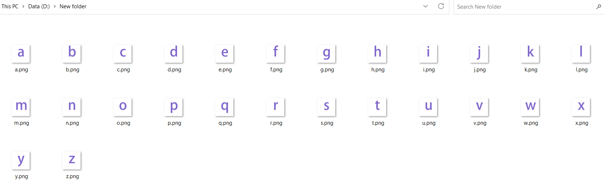
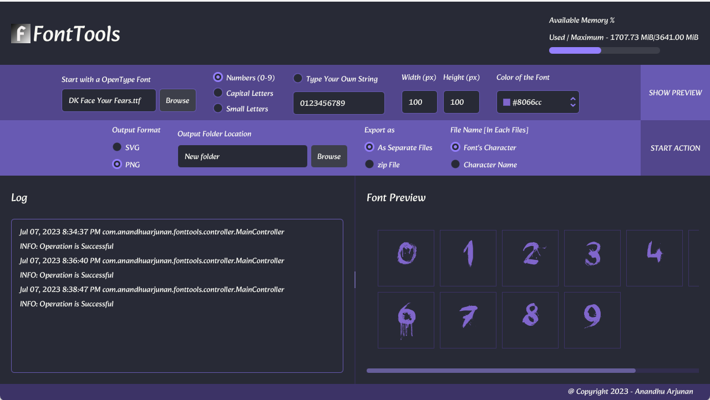

# FontTools - *Make png or svg files out of Font Characters.*
It contains different tools such as Font to Single Character in .png format and .svg format converter .etc
## Use Case Scenarios : 
 1. The Generated png files can be helpful in creating WatchFaces.

## Screenshots

## Requirements

- Java 8 [Oracle JDK or any OpenJDK with OpenJFX]
- Maven

## Tech

- [opentype4j](https://github.com/Jkanon/opentype4j) - A library to Parse OpenType Fonts
- [zt-zip](https://github.com/zeroturnaround/zt-zip) - Library to Create zip files.
- [atlantafx](https://github.com/mkpaz/atlantafx) - Theme Library - User Agent Stylesheet.

## Installation
Get the executable jar in target folder

    mvn clean package
    
## Run
    
    java -jar fonttools-<version>.jar
